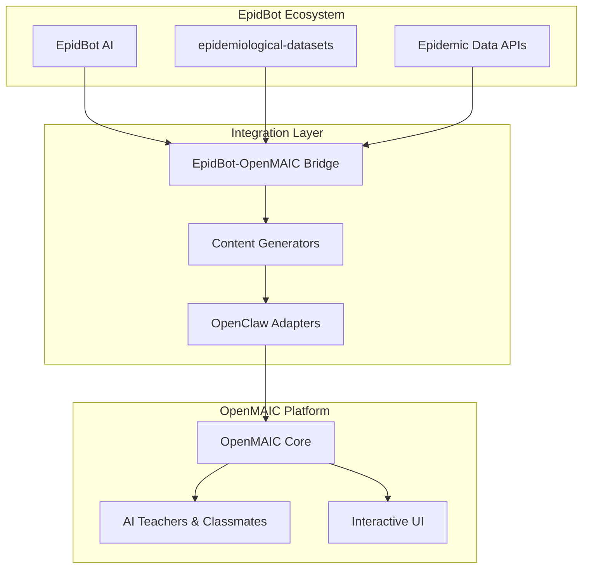

# 🤖🎓 EpidBot-OpenMAIC Integration

> **AI-Powered Epidemiological Education Platform**
> 
> Integrating EpidBot's real-time disease surveillance capabilities with OpenMAIC's multi-agent interactive classroom platform for immersive public health training.

[](https://opensource.org/licenses/MIT)
[](https://www.python.org/downloads/)
[](https://github.com/openclaw)

---

## 🌟 Overview

This project creates a bridge between two powerful open-source platforms:

- **[EpidBot](https://github.com/Deeplearn-PeD/EpiDBot)** - AI assistant for epidemiology with real-time access to disease surveillance data (SINAN, HealthMap, WHO, etc.)
- **[OpenMAIC](https://github.com/THU-MAIC/OpenMAIC)** - Multi-agent interactive classroom platform from Tsinghua University

### 🎯 Vision

Transform public health education by creating immersive, data-driven learning experiences where:
- AI teachers deliver dynamic lessons on disease surveillance
- AI classmates engage in realistic scenario discussions
- Real epidemiological data powers simulations and case studies
- Students learn by analyzing actual outbreak data

---

## 🚀 Key Features (Planned)

| Feature | Description | Status |
|---------|-------------|--------|
| **Dynamic Content Generation** | Auto-generate lessons from real surveillance data | 🔮 Phase 1 |
| **AI-Powered Simulations** | Interactive outbreak scenarios with real data | 🔮 Phase 2 |
| **Multi-Agent Discussions** | AI classmates debate strategies using live data | 🔮 Phase 2 |
| **Smart Quizzes** | Auto-generated assessments based on current epidemics | 🔮 Phase 1 |
| **Real-Time Dashboard** | Live disease metrics during lessons | 🔮 Phase 3 |
| **Certification System** | Completion certificates for health professionals | 🔮 Phase 3 |

---

## 📋 Quick Start

```bash
# Clone the repository
git clone https://github.com/deeplearn/EpidBot-OpenMAIC.git
cd EpidBot-OpenMAIC

# Install dependencies
pip install -e ".[dev]"

# Configure environment
cp .env.example .env
# Edit .env with your API keys

# Run integration test
python examples/test_integration.py
```

---

## 🗺️ Repository Structure

```
EpidBot-OpenMAIC/
├── 📁 docs/                    # Documentation
│   ├── IMPLEMENTATION_PLAN.md  # Detailed roadmap
│   ├── ARCHITECTURE.md         # Technical architecture
│   ├── USE_CASES.md            # Usage scenarios
│   └── API_REFERENCE.md        # API documentation
├── 📁 src/                     # Source code
│   ├── integration/            # Core integration module
│   ├── adapters/               # Platform adapters
│   ├── content_generators/     # Lesson content generators
│   └── utils/                  # Utilities
├── 📁 examples/                # Example scripts
├── 📁 tests/                   # Test suite
├── 📁 deployments/             # Deployment configs
└── 📁 notebooks/               # Jupyter notebooks
```

---

## 🛤️ Implementation Roadmap

### Phase 1: Foundation (Weeks 1-4)
- [ ] Basic API integration between EpidBot ↔ OpenMAIC
- [ ] Content generator for dengue surveillance
- [ ] Simple quiz generation from SINAN data
- [ ] Proof-of-concept classroom

### Phase 2: Core Features (Weeks 5-12)
- [ ] Multi-disease support (Zika, Chikungunya, COVID-19)
- [ ] Interactive outbreak simulations
- [ ] AI classmates with EpidBot data access
- [ ] Export to PPTX and HTML

### Phase 3: Production (Weeks 13-20)
- [ ] Real-time dashboard integration
- [ ] Advanced analytics and reporting
- [ ] Certification system
- [ ] Pilot deployment with health departments

📖 **See [docs/IMPLEMENTATION_PLAN.md](docs/IMPLEMENTATION_PLAN.md) for detailed roadmap**

---

## 💡 Example Use Cases

### 1. Training Health Agents
```
User: "Create a 2-hour training on dengue surveillance"

System:
1. Fetches latest SINAN data via EpidBot
2. Generates slides with real case numbers
3. Creates outbreak simulation scenario
4. Prepares quiz on current risk factors
5. Launches OpenMAIC classroom
6. AI teacher presents using live data
```

### 2. University Course Module
```
Professor: "Generate week 3 materials on arbovirus epidemiology"

System:
1. Analyzes PAHO surveillance data
2. Creates comparative case studies (Brazil, Colombia, Argentina)
3. Generates interactive vector control simulation
4. Sets up AI classmates for group discussions
5. Exports complete module to LMS
```

### 3. Emergency Response Workshop
```
Manager: "Emergency workshop on Zika outbreak response"

System:
1. Retrieves real-time outbreak data
2. Creates time-pressured scenario simulation
3. Configures AI roles (surveillance team, field agents, etc.)
4. Tracks decision-making metrics
5. Generates post-training report
```

📖 **See [docs/USE_CASES.md](docs/USE_CASES.md) for full scenarios**

---

## 🏗️ Architecture



📖 **See [docs/ARCHITECTURE.md](docs/ARCHITECTURE.md) for detailed design**

---

## 🤝 Contributing

We welcome contributions! See [CONTRIBUTING.md](CONTRIBUTING.md) for guidelines.

### Priority Areas
- 🎨 UI/UX improvements
- 📊 New data source integrations
- 🌍 Multi-language support
- 🧪 Test coverage
- 📚 Documentation

---

## 📄 License

This project is licensed under the MIT License - see [LICENSE](LICENSE) file.

---

## 🙏 Acknowledgments

- [OpenMAIC](https://github.com/THU-MAIC/OpenMAIC) team at Tsinghua University
- [EpidBot](https://github.com/Deeplearn-PeD/EpiDBot) team at Kwar-AI
- [epidemiological-datasets](https://github.com/fccoelho/epidemiological-datasets) contributors
- All open-source epidemiology projects we build upon

---

## 📞 Contact

- **Issues:** [GitHub Issues](https://github.com/deeplearn/EpidBot-OpenMAIC/issues)
- **Discussions:** [GitHub Discussions](https://github.com/deeplearn/EpidBot-OpenMAIC/discussions)
- **Email:** contact@kwar-ai.com.br

---

<p align="center">
  <i>Building the future of AI-powered public health education 🌍</i>
</p>
