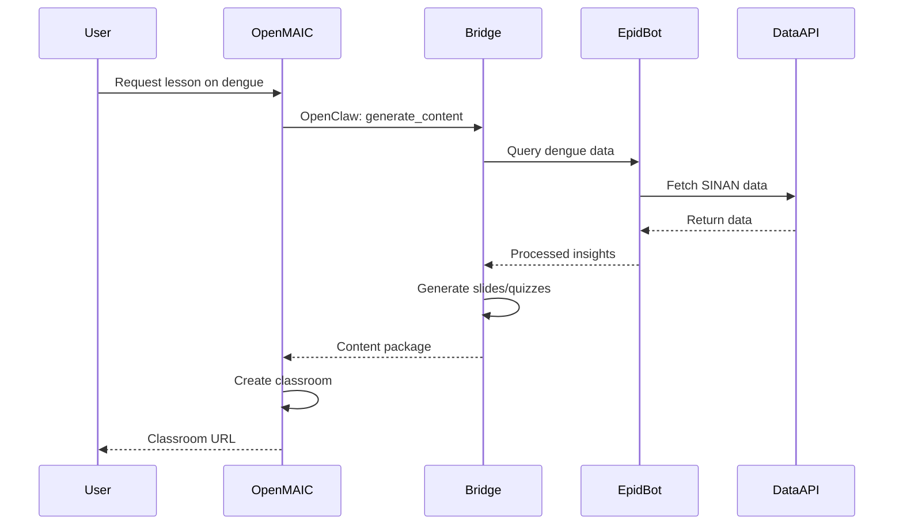
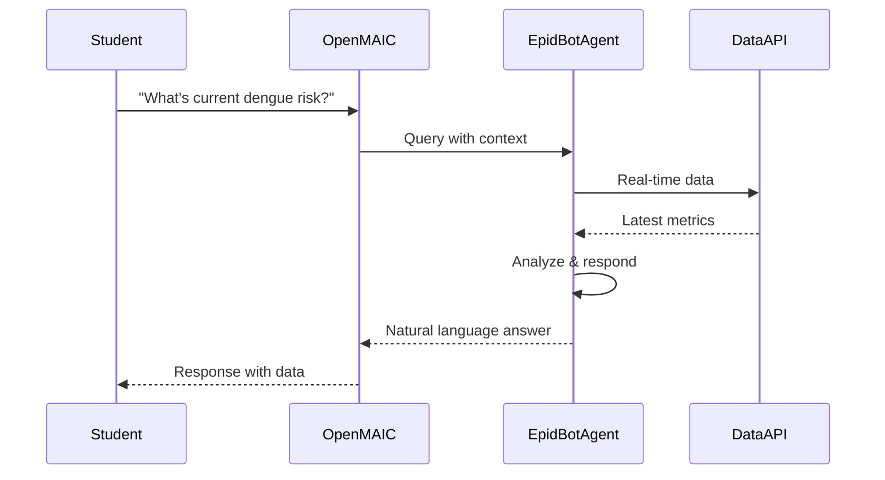

# 🏗️ Architecture: EpidBot-OpenMAIC Integration

> **Technical design and system architecture**

---

## 📐 High-Level Architecture

```
┌─────────────────────────────────────────────────────────────────────┐
│                        USER INTERFACE LAYER                         │
│  ┌──────────────┐  ┌──────────────┐  ┌──────────────┐              │
│  │   Web App    │  │  Telegram    │  │    API       │              │
│  │   (OpenMAIC) │  │   (EpidBot)  │  │   Clients    │              │
│  └──────┬───────┘  └──────┬───────┘  └──────┬───────┘              │
└─────────┼─────────────────┼─────────────────┼───────────────────────┘
          │                 │                 │
          └─────────────────┼─────────────────┘
                            │
┌───────────────────────────▼───────────────────────────────────────┐
│                     INTEGRATION LAYER                              │
│  ┌─────────────────────────────────────────────────────────────┐  │
│  │                OpenClaw Gateway                              │  │
│  │  ┌────────────┐  ┌────────────┐  ┌────────────┐             │  │
│  │  │  Request   │  │   Auth     │  │  Routing   │             │  │
│  │  │  Handler   │→ │   Middleware│→ │   Engine   │             │  │
│  │  └────────────┘  └────────────┘  └────────────┘             │  │
│  └─────────────────────────────────────────────────────────────┘  │
│                                                                    │
│  ┌─────────────────────────────────────────────────────────────┐  │
│  │              Content Generation Engine                       │  │
│  │  ┌──────────┐ ┌──────────┐ ┌──────────┐ ┌──────────┐        │  │
│  │  │  Lesson  │ │   Quiz   │ │Simulation│ │  Report  │        │  │
│  │  │ Generator│ │Generator │ │Generator │ │Generator │        │  │
│  │  └──────────┘ └──────────┘ └──────────┘ └──────────┘        │  │
│  └─────────────────────────────────────────────────────────────┘  │
└───────────────────────────────────────────────────────────────────┘
          │                              │
          ▼                              ▼
┌─────────────────────┐      ┌─────────────────────────────┐
│   EPIDBOT LAYER     │      │     OPENMAIC LAYER          │
│  ┌───────────────┐  │      │  ┌───────────────────────┐  │
│  │   EpidBot     │  │      │  │   OpenMAIC Core       │  │
│  │   AI Engine   │  │      │  │   ┌─────────────┐     │  │
│  └───────┬───────┘  │      │  │   │ AI Teachers │     │  │
│          │          │      │  │   └──────┬──────┘     │  │
│  ┌───────▼───────┐  │      │  │   ┌─────────────┐     │  │
│  │  epidemio-    │  │      │  │   │AI Classmates│     │  │
│  │  logical-     │  │      │  │   └──────┬──────┘     │  │
│  │  datasets     │  │      │  │   ┌─────────────┐     │  │
│  └───────┬───────┘  │      │  │   │ Interactive │     │  │
│          │          │      │  │   │    UI       │     │  │
│  ┌───────▼───────┐  │      │  │   └─────────────┘     │  │
│  │   External    │  │      │  └───────────────────────┘  │
│  │     APIs      │  │      │                             │
│  │(SINAN,WHO,etc)│  │      └─────────────────────────────┘
│  └───────────────┘  │
└─────────────────────┘
```

---

## 🔌 Integration Patterns

### Pattern 1: OpenClaw Bridge (Primary)



### Pattern 2: EpidBot as AI Classmate



---

## 🧩 Core Components

### 1. OpenClaw Gateway

**Purpose:** Standardized interface for OpenMAIC communication

```python
# src/integration/openclaw_gateway.py

class OpenClawGateway:
    """
    Handles all OpenClaw protocol communications
    with OpenMAIC platform.
    """
    
    def __init__(self, config: GatewayConfig):
        self.openmaic_endpoint = config.openmaic_url
        self.auth_token = config.auth_token
        
    async def handle_request(self, request: ClawRequest) -> ClawResponse:
        """Process incoming OpenClaw requests"""
        if request.action == "generate_lesson":
            return await self._handle_lesson_generation(request)
        elif request.action == "query_data":
            return await self._handle_data_query(request)
        # ... more handlers
        
    async def send_to_openmaic(self, data: dict) -> dict:
        """Send data to OpenMAIC via OpenClaw"""
        async with httpx.AsyncClient() as client:
            response = await client.post(
                f"{self.openmaic_endpoint}/claw",
                json=data,
                headers={"Authorization": f"Bearer {self.auth_token}"}
            )
            return response.json()
```

### 2. Content Generation Engine

**Purpose:** Transform epidemiological data into educational content

```python
# src/content_generators/lesson_generator.py

class LessonGenerator:
    """
    Generates complete lessons from disease surveillance data.
    """
    
    def __init__(self, epidbot_client: EpidBotClient):
        self.epidbot = epidbot_client
        self.template_engine = TemplateEngine()
        
    async def generate(
        self,
        disease: str,
        region: str,
        timeframe: str,
        audience: str = "health_professionals"
    ) -> LessonContent:
        """
        Generate complete lesson package.
        """
        # Fetch data
        data = await self.epidbot.get_surveillance_data(
            disease=disease,
            region=region,
            timeframe=timeframe
        )
        
        # Generate components
        slides = self._generate_slides(data, audience)
        quizzes = self._generate_quizzes(data)
        simulations = self._generate_simulations(data)
        
        return LessonContent(
            slides=slides,
            quizzes=quizzes,
            simulations=simulations,
            metadata=self._generate_metadata(data)
        )
```

### 3. EpidBot Adapter

**Purpose:** Interface with EpidBot AI via session-based chat API

```python
# src/adapters/epidbot_adapter.py

class EpidBotAdapter:
    """
    HTTP client for EpidBot Chat API.
    Uses session-based chat to maintain context across requests.
    """
    
    def __init__(self, base_url: str, api_key: str):
        self.base_url = base_url.rstrip("/")
        self.api_key = api_key
        self._session_id: int | None = None
        
    def _get_headers(self) -> dict:
        return {
            "X-API-Key": self.api_key,
            "Content-Type": "application/json",
        }
        
    async def create_session(self, name: str = "openmaic-bridge") -> int:
        """Create a new chat session."""
        async with httpx.AsyncClient(timeout=30.0) as client:
            response = await client.post(
                f"{self.base_url}/api/v1/sessions",
                json={"name": name},
                headers=self._get_headers(),
            )
            result = response.json()
            self._session_id = result["id"]
            return self._session_id
            
    async def chat(self, message: str) -> str:
        """Send a chat message and get the response."""
        async with httpx.AsyncClient(timeout=600.0) as client:
            response = await client.post(
                f"{self.base_url}/api/v1/chat",
                json={
                    "message": message,
                    "session_id": self._session_id,
                },
                headers=self._get_headers(),
            )
            result = response.json()
            return result.get("content", "")
            
    async def health_check(self) -> bool:
        """Check if EpidBot server is healthy."""
        async with httpx.AsyncClient(timeout=10.0) as client:
            response = await client.get(
                f"{self.base_url}/api/v1/health",
                headers={"X-API-Key": self.api_key},
            )
            response.raise_for_status()
            return True
```

**API Endpoints:**
| Endpoint | Method | Description |
|----------|--------|-------------|
| `/api/v1/sessions` | POST | Create a new chat session |
| `/api/v1/chat` | POST | Send a message in a session |
| `/api/v1/health` | GET | Health check |

**Authentication:** All requests require `X-API-Key` header

### 4. OpenMAIC Adapter

**Purpose:** Interface with OpenMAIC classroom platform

```python
# src/adapters/openmaic_adapter.py

class OpenMAICAdapter:
    """
    Adapter for OpenMAIC multi-agent classroom platform.
    """
    
    def __init__(self, api_key: str, base_url: str):
        self.client = OpenMAICClient(api_key, base_url)
        
    async def create_classroom(
        self,
        title: str,
        content: LessonContent,
        config: ClassroomConfig
    ) -> Classroom:
        """
        Create interactive classroom with generated content.
        """
        # Upload content to OpenMAIC
        content_id = await self.client.upload_content(content)
        
        # Configure AI agents
        agents = self._configure_agents(config)
        
        # Create classroom
        classroom = await self.client.create_classroom(
            title=title,
            content_id=content_id,
            agents=agents,
            settings=config.settings
        )
        
        return Classroom(
            id=classroom.id,
            url=classroom.url,
            access_code=classroom.code
        )
        
    def _configure_agents(self, config: ClassroomConfig) -> List[Agent]:
        """Configure AI teachers and classmates."""
        agents = []
        
        # AI Teacher
        agents.append(Agent(
            role="teacher",
            persona=config.teacher_persona or "expert_epidemiologist",
            capabilities=["lecture", "answer_questions", "facilitate_discussion"]
        ))
        
        # AI Classmates
        for i in range(config.num_classmates):
            agents.append(Agent(
                role="classmate",
                persona=self._get_classmate_persona(i),
                capabilities=["ask_questions", "discuss", "debate"],
                data_access=True  # Enable EpidBot data access
            ))
            
        return agents
```

---

## 🗄️ Data Flow

### Content Generation Flow

```
1. User Request
   └── "Create lesson on dengue in São Paulo"
   
2. Content Generation Engine
   ├── Fetch SINAN data (via epidemiological-datasets)
   ├── Query EpidBot for AI analysis
   ├── Generate slide content
   ├── Create quiz questions
   └── Build simulation scenarios
   
3. Content Package
   ├── slides.json (slide content)
   ├── quizzes.json (assessments)
   ├── simulation.json (interactive scenarios)
   └── metadata.json (context, sources, timestamps)
   
4. OpenMAIC Integration
   ├── Upload content package
   ├── Configure AI agents
   ├── Create classroom instance
   └── Generate access URL
   
5. User Delivery
   └── Classroom URL with all content
```

---

## 🔐 Security Architecture

### Authentication Layers

```
┌─────────────────────────────────────────┐
│  Layer 1: API Gateway                    │
│  - Rate limiting                         │
│  - IP whitelisting                       │
│  - DDoS protection                       │
└─────────────────┬───────────────────────┘
                  │
┌─────────────────▼───────────────────────┐
│  Layer 2: Authentication                 │
│  - API key validation                    │
│  - JWT tokens (OpenClaw)                 │
│  - OAuth2 (user auth)                    │
└─────────────────┬───────────────────────┘
                  │
┌─────────────────▼───────────────────────┐
│  Layer 3: Authorization                  │
│  - Role-based access control             │
│  - Resource permissions                  │
│  - Data access limits                    │
└─────────────────────────────────────────┘
```

### Data Protection

- **PII Handling:** No patient data stored, only aggregated surveillance
- **Encryption:** TLS 1.3 for all communications
- **API Keys:** Rotated every 90 days
- **Audit Logging:** All data access logged

---

## 📊 Scalability Design

### Horizontal Scaling

```
                    ┌──────────────┐
                    │   Load       │
                    │   Balancer   │
                    └──────┬───────┘
                           │
           ┌───────────────┼───────────────┐
           │               │               │
    ┌──────▼──────┐ ┌──────▼──────┐ ┌──────▼──────┐
    │  Gateway    │ │  Gateway    │ │  Gateway    │
    │  Instance 1 │ │  Instance 2 │ │  Instance 3 │
    └──────┬──────┘ └──────┬──────┘ └──────┬──────┘
           │               │               │
           └───────────────┼───────────────┘
                           │
                    ┌──────▼──────┐
                    │  Redis      │
                    │  Cache      │
                    └─────────────┘
```

### Caching Strategy

| Data Type | Cache Duration | Strategy |
|-----------|---------------|----------|
| Surveillance data | 1 hour | Time-series optimized |
| Generated content | 24 hours | Content-addressable |
| User sessions | Session | Distributed cache |
| AI responses | 5 minutes | Semantic similarity |

---

## 🛠️ Technology Stack

### Backend
- **Language:** Python 3.12+
- **Framework:** FastAPI (async)
- **HTTP Client:** httpx
- **Validation:** Pydantic

### Integration
- **Protocol:** OpenClaw
- **APIs:** REST + WebSocket
- **Auth:** JWT + API Keys

### Data
- **Cache:** Redis
- **Storage:** PostgreSQL (metadata)
- **Object Storage:** MinIO/S3 (content)

### External
- **EpidBot:** OpenClaw endpoint
- **OpenMAIC:** OpenClaw endpoint
- **Data Sources:** epidemiological-datasets

---

## 📁 File Organization

```
src/
├── integration/           # Core integration logic
│   ├── __init__.py
│   ├── openclaw_gateway.py
│   ├── request_router.py
│   └── auth_middleware.py
│
├── adapters/             # Platform adapters
│   ├── __init__.py
│   ├── epidbot_adapter.py
│   ├── openmaic_adapter.py
│   └── base_adapter.py
│
├── content_generators/   # Content generation
│   ├── __init__.py
│   ├── lesson_generator.py
│   ├── quiz_generator.py
│   ├── simulation_generator.py
│   └── templates/
│       ├── slide_template.j2
│       ├── quiz_template.j2
│       └── simulation_template.j2
│
├── models/              # Data models
│   ├── __init__.py
│   ├── content.py
│   ├── classroom.py
│   └── requests.py
│
├── utils/               # Utilities
│   ├── __init__.py
│   ├── cache.py
│   ├── logging.py
│   └── validators.py
│
└── config/             # Configuration
    ├── __init__.py
    ├── settings.py
    └── environments/
```

---

## 🔗 API Contracts

### OpenClaw Request Format

```json
{
  "version": "1.0",
  "action": "generate_lesson",
  "request_id": "uuid",
  "timestamp": "2025-03-25T10:00:00Z",
  "payload": {
    "disease": "dengue",
    "region": "São Paulo",
    "timeframe": "last_30_days",
    "audience": "health_agents",
    "language": "pt-BR"
  },
  "metadata": {
    "source": "openmaic",
    "user_id": "user_123"
  }
}
```

### OpenClaw Response Format

```json
{
  "version": "1.0",
  "request_id": "uuid",
  "status": "success",
  "timestamp": "2025-03-25T10:00:05Z",
  "payload": {
    "classroom_id": "class_123",
    "classroom_url": "https://openmaic.io/class/class_123",
    "content_summary": {
      "num_slides": 12,
      "num_quizzes": 4,
      "estimated_duration": "45_minutes"
    }
  },
  "metadata": {
    "processing_time_ms": 2500,
    "data_sources": ["SINAN", "weather_data"]
  }
}
```

---

## 🧪 Testing Strategy

### Test Layers

1. **Unit Tests:** Individual components
2. **Integration Tests:** Adapter interactions
3. **E2E Tests:** Full user workflows
4. **Load Tests:** Performance under load

### Test Data

- Mock surveillance data (no real PII)
- Synthetic classroom scenarios
- Fuzzing for edge cases

---

*Architecture Version: 1.0*  
*Last Updated: March 2025*
